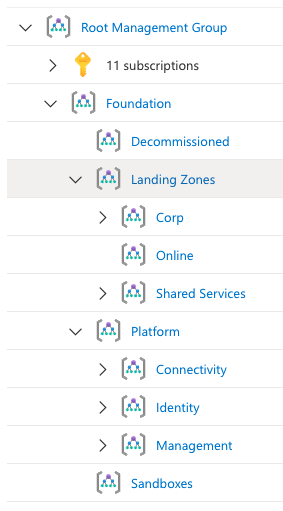
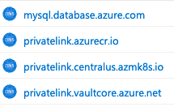

# Core CAF Foundation module

This Terraform module deploys the core foundation for Liatrio's Cloud Adoption Framework. It provides the necessary connectivity, identity, policy, and management resources needed to deploy shared services and landing zone modules.

This module requires three subscriptions (connectivity, identity and management) be created _before_ applying the module. The [subscriptions/foundation](../../subscriptions/foundation/) module is provided to manage the subscriptions via Terraform or they can be managed by another process. An azurerm provider must be defined for each subscription and passed into the module. See [examples/terraform/foundation](../../examples/terraform/foundation/) for an example configuring the providers and passing them to the module.

This module also requires that Custom Policies and Policy Sets have been deployed to this tenant, as described in [liatrio/azure-policies](https://github.com/liatrio/azure-policies)

## Inputs Required

This module depends on the subscriptions being created before use, as well as a few resource dependencies from your existing Azure foundation. Here is the list of inputs.

Inputs:

Name|Source|Description|Sample Values
--|--|--|--
location|variable (.tfvars or terragrunt)|short code form for Azure region|`eastus` or `westus` etc
virtual_hub_address_cidr|variable (.tfvars or terragrunt)|RFC 1918 CIDR network range for your entire landing zone|`10.100.0.0/23` or `172.18.0.0/23` etc
connectivity_apps_address_cidr|variable (.tfvars or terragrunt)|CIDR network range for any shared connectivity apps|`10.100.3.0/24`
tenant_id|variable (.tfvars or terragrunt)|Your Azure Tenant ID|`abcd1234-ef56-ab12-ab12-abcdef123456`
prefix|variable (.tfvars or terragrunt)|Naming prefix to use for your landing zone|`pre`
root_dns_zone|variable (.tfvars or terragrunt)|Your preferred root DNS zone name as configured in Azure. From this root dns zone, child zones and records will be created|`mycorp.com`
root_dns_tags|variable (.tfvars or terragrunt)|Your preferred tags to apply to the root dns zone|`my-tag`
vpn_client_pool_address_cidr|variable (.tfvars or terragrunt)|`OPTIONAL` - CIDR network range for VPN users|`10.100.2.0/24`
vpn_service_principal_application_id|upstream dependency on creation of an `azuread_service_principal` for your VPN application registration|`OPTIONAL` - `application_id` of service principal for VPN|`abcd1234-ef56-ab12-ab12-abcdef123456`
landing_zone_mg|variable (.tfvars or terragrunt)|`OPTIONAL` - map of objects defining the management group(s) in which your landing zone will exist|`{ management_group_1 : { display_name = "Management Group 1", policy_ids = [ { policy_set_id : "/providers/Microsoft.Authorization/policySetDefinitions/abcd1234-ef56-ab12-ab12-abcdef123456" } ] }, management_group_2 : { display_name = "Management Group 2", policy_ids = [] } }`
enable_point_to_site_vpn|variable (.tfvars or terragrunt)|`OPTIONAL` - Boolean to enable/disable creation of user p2s vpn. Defaults to true|`true`
enable_budget_alerts|variable (.tfvars or terragrunt)|`OPTIONAL` - Boolean to enable/disable the creation of budget alert function app and child resources. Defaults to false|`true`
env|variable (.tfvars or terragrunt)|String describing which environment we're in. Used in creation of resource names|`dev` or `prod` etc
sas_time_start|variable (.tfvars or terragrunt)|`OPTIONAL` - Start time for the sas token that allows the function app to access the package in blob storage|`"2022-05-01T00:00:00Z"`
sas_time_end|variable (.tfvars or terragrunt)|`OPTIONAL` - Expiry time for the sas token that allows the function app to access the package in blob storage|`"2024-01-01T00:00:00Z"`
slack_webhook_url|variable (.tfvars or terragrunt)|`OPTIONAL` - Incoming webhook generated in Slack that alerts will be posted to|`"https://hooks.slack.com/..."`
teams_webhook_url|variable (.tfvars or terragrunt)|`OPTIONAL` - Incoming webhook generated in Microsoft Teams that alerts will be posted to|`"https://....webhook.office.com/webhook2/..."`
budget_tags|variable (.tfvars or terragrunt)|`OPTIONAL` - The tags to be applied to resources created by the budget alerts module|`{"client": "internal"}`
budgets|variable (.tfvars or terragrunt)|`OPTIONAL` - A map of maps which has at the top level each subscription, and within each subscription the variables shown in this example, which are defined below|`{"caf-management" : {"subscription_id" : "<subscription_id>","budget_time_start" : "2022-05-01T00:00:00Z","budget_time_grain" : "Monthly""budget_amount" : "1000","budget_operator" : "EqualTo","budget_threshold" : 80.0,},"caf-connectivity" : {"subscription_id" : "<subscription_id>","budget_time_start" : "2022-05-01T00:00:00Z","budget_time_grain" : "Quarterly""budget_amount" : "100","budget_operator" : "GreaterThan","budget_threshold" : 80.0,}}`
subscription_id|variable (.tfvars or terragrunt)|`OPTIONAL` - A map of subscription ids to add the budgets to|`{"subscription-id": <subscription-id>}`
budget_time_start|variable (.tfvars or terragrunt)|`OPTIONAL` - The start date for the budget |`"2022-05-01T00:00:00Z"`
budget_amounts|variable (.tfvars or terragrunt)|`OPTIONAL` - The total amount of cost to track with the budget|`{"caf-management": 1000, "caf-connectivity": 100}`
budget_time_grains|variable (.tfvars or terragrunt)|`OPTIONAL` - The time covered by a budget. Tracking of the amount will be reset based on the time grain|`{"caf-management": "Monthly", "caf-connectivity": "Quarterly"}`
budget_operator|variable (.tfvars or terragrunt)|`OPTIONAL` - The operator to use for budget comparison|`{"caf-management": "EqualTo", "caf-connectivity": "GreaterThan"}`
budget_threshold|variable (.tfvars or terragrunt)|`OPTIONAL` - Threshold value associated with a notification. Notification is sent when the cost exceeded the threshold. It is always percent and has to be between 0.01 and 1000|`{"caf-management" : 80.0, "caf-connectivity" : 80.0}`

It also requires a few inputs.

## Resources Created

This module creates the following resources.

### Management Groups

This list of management groups allows hierarchically assigned role based access control. Their relationships are also managed via the terraform module

```yaml
azurerm_management_group
  foundation
    decommissioned
    landing_zones
      dynamic["corp"]
      dynamic["online"]
      shared_svc
  platform
    connectivity
    identity
    management
  sandboxes
```

  

### Networking

Several particular network resources are configured, allowing communication within your landing zone(s) and to your connected networks.
#### Core Network components

The VWAN managed Hub and Spoke setup is used.

```yaml
azurerm_network_security_group.connectivity_security_group
azurerm_resource_group.caf_connectivity
azurerm_virtual_hub.caf_hub
azurerm_virtual_hub_connection.connectivity_hub_connection
azurerm_virtual_network.connectivity_vnet
azurerm_virtual_wan.caf_vwan

```
  

#### Public DNS Zone

A Public DNS Zone is configured for any public app hosting or name resolution needs.

```yaml
module.public_dns
  azurerm_dns_zone.public_dns_zone
```

#### Private DNS Zones

Private DNS zones are created for each internal service deployed.

```yaml
module.azure_paas_private_dns["container_registry"]
  azurerm_private_dns_zone.private_dns_zone
  azurerm_private_dns_zone_virtual_network_link.private_dns_zone_link
module.azure_paas_private_dns["key_vault"]
  azurerm_private_dns_zone.private_dns_zone
  azurerm_private_dns_zone_virtual_network_link.private_dns_zone_link
module.azure_paas_private_dns["kubernetes_cluster"]
  azurerm_private_dns_zone.private_dns_zone
  azurerm_private_dns_zone_virtual_network_link.private_dns_zone_link
module.azure_paas_private_dns["mysql"]
  azurerm_private_dns_zone.private_dns_zone
  azurerm_private_dns_zone_virtual_network_link.private_dns_zone_link

```

  

#### Self Managed Private DNS resolver

To run private networking and integrate it with your environments, private DNS

```yaml
module.vpn_dns_resolver
  azurerm_container_group.coredns
  azurerm_network_profile.coredns_network_profile
  azurerm_subnet.coredns_subnet

```

#### Optional Point to Site User VPN
```yaml
azurerm_point_to_site_vpn_gateway.hub_vpn_gateway
azurerm_vpn_server_configuration.vpn_server_config
```
### Policy

Policy configuration is known to Terraform via this module, but not fully managed here. Instead, policy-as-code is managed via a linked git repo

```yaml
module.connectivity-policy-sets
  module.policy_assignment[0]
    azurerm_management_group_policy_assignment.policy_set_assignment
    random_id.policy_association_name
module.foundation-policy-sets
  module.policy_assignment[0]
    azurerm_management_group_policy_assignment.policy_set_assignment
    random_id.policy_association_name
module.landing_zones-policy-sets
  module.policy_assignment[0]
    azurerm_management_group_policy_assignment.policy_set_assignment
    random_id.policy_association_name
module.policy-sets-dynamic-mgs["corp"]
  module.policy_assignment[0]
    azurerm_management_group_policy_assignment.policy_set_assignment
    random_id.policy_association_name
module.shared_svc-policy-sets
  module.policy_assignment[0]
    azurerm_management_group_policy_assignment.policy_set_assignment
    random_id.policy_association_name
```
