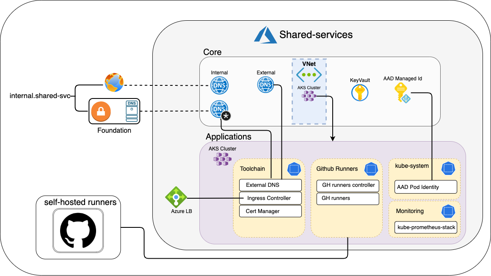

# Shared Services

The goal of Shared Services is to create the infrastrusture necessary for hosting a hub of reusable workloads.

Shared Services is split into two stages: core and applications.

# Core

The core components are the AKS cluster itself, along with the required resources to operate it.

- Resource Group
- AKS Cluster
- Virtual Network
- Privatelink DNS Zone for Kubernetes(a prexisting)
- Virtual Network connection to a pre-existing Virtual Hub
- AAD Managed Identities (Each identity is scoped and assigned roles to support its specific service)
- KeyVault (This instance of keyVault is only to be utilized by shared services workloads)
- Public DNS
- Split-horizon DNS (public and private DNS zone)
  - This is used for internal workloads that require public and private facing versions of the same domain. Cert-manager issuers utilize the public domain to perform a [DNS-01 challenge](https://letsencrypt.org/docs/challenge-types/#dns-01-challenge) in order to generate a certificate for the private domain.

# Applications

The application components are the deployed workloads that facilitate use of an AKS cluster.
- toolchain
  - [Cert Manager](https://cert-manager.io/docs/)
  - [Ingress Controller](https://github.com/kubernetes/ingress-nginx)
  - [External DNS](https://github.com/kubernetes-sigs/external-dns)
- github-runners (runners utilize AAD auth to host workflow deployments within the Azure Cloud network.)
  - [github-runners](https://docs.github.com/en/actions/hosting-your-own-runners/about-self-hosted-runners)
  - github-runners controller
- monitoring
  - [kube-prometheus-stack](https://github.com/prometheus-community/helm-charts/tree/main/charts/kube-prometheus-stack)
- kube-system
  - [AAD-pod-identity](https://github.com/Azure/aad-pod-identity) (AAD Pod Identity enables Kubernetes applications to access cloud resources securely with Azure Active Directory.)

# Use case

The intended use of this module is to create a hub for reusable workloads.

An example workflow would contain the following  

