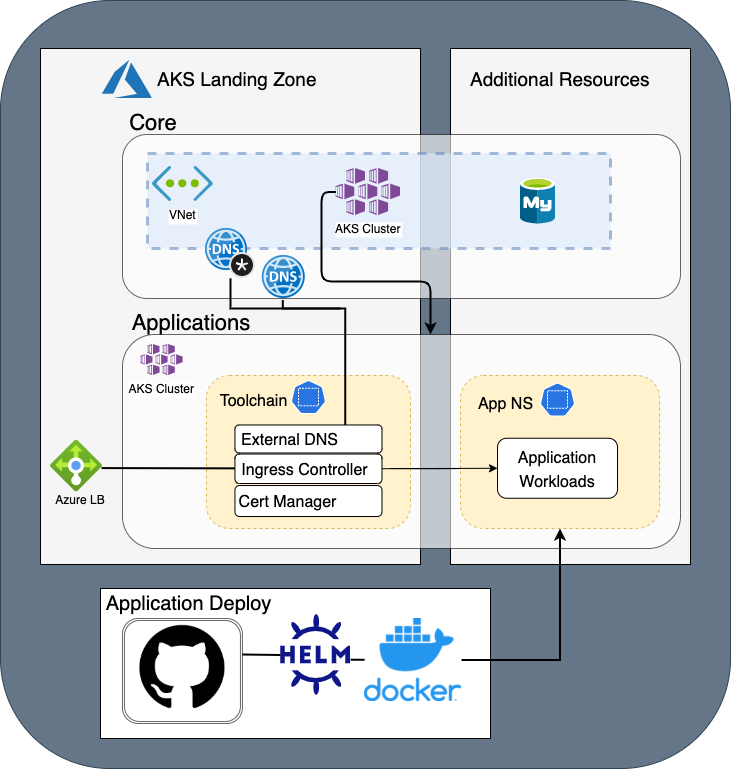

# AKS Landing Zone

The goal of this landing zone is to create the infrastructure necessary for hosting containerized applications on Azure Kubernetes Service.

The AKS landing zone is split into two stages: core and applications.

# Core

The core components are the AKS cluster itself, along with the required resources to operate it.

- Resource Group
- AKS Cluster
- Virtual Network
- Privatelink DNS Zone for Kubernetes
- Virtual Network connection to a pre-existing Virtual Hub

# Applications

The application components are the deployed workloads that facilitate use of an AKS cluster.

- Kubernetes namespace for toolchain in AKS cluster
- Cert Manager
- Ingress Controller
- External DNS

# Use case

The intended use of this module is to create a well provisioned AKS cluster that includes a functional starting configuration and can be used for application workloads immediately.

Additional resources required by the application could be deployed on top of the default landing zone setup.

An example workflow would contain the following  

